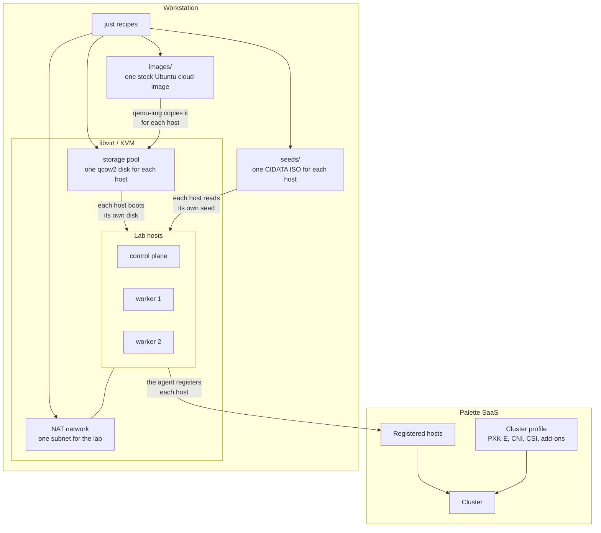
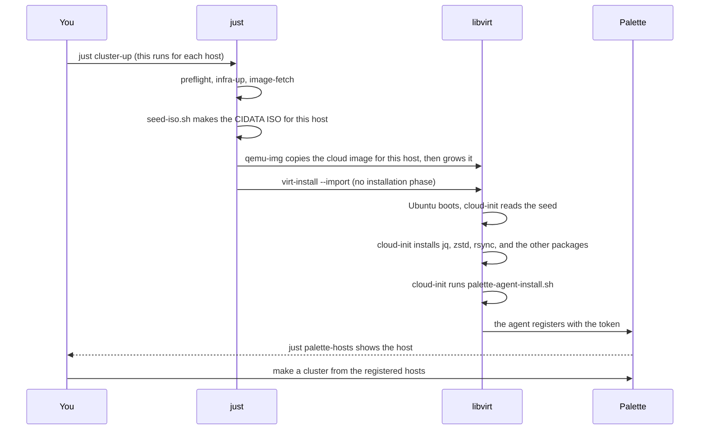

# Architecture

This page describes what the lab builds.

The lab makes one virtual machine for each Kubernetes node. Each machine boots
a stock Ubuntu cloud image. cloud-init then installs the Palette agent, and the
agent registers the machine with your Palette tenant. Palette makes the cluster
from the machines that registered.

## The parts

Every host gets its own copy of the cloud image and its own seed ISO. The lab
downloads the image one time. `qemu-img` then copies it into the storage pool
for each host, which keeps the hosts independent.

The workstation owns the virtual machines. Palette owns the cluster profile and
the cluster. The seed ISO is the only link between the two. It carries your
endpoint, your project, and your registration token.

The names in this diagram are generic. `LAB_NAME` gives the true names: a lab
named `pethelio` has the network `pethelio-net`, the pool `pethelio-pool`, and
the domains `pethelio-cp-1`, `pethelio-wk-1`, and `pethelio-wk-2`. See
[The project layout](./project-layout.md#what-new-project-does).

## The lifecycle of one host

## The first boot

**There is no installation phase.** The cloud image already holds a working
Ubuntu. `virt-install --import` starts it. `qemu-img convert` copies the image
for each host, and `qemu-img resize` grows the copy. cloud-init grows the file
system at the first boot. A host is ready in seconds.

**The agent installs one time.** cloud-init writes a marker file at
`/var/lib/palette-agent-installed`. A second boot reads the marker and makes no
change.

## Where the state lives

| State | Location | Removed by |
| --- | --- | --- |
| Virtual machines | libvirt, `qemu:///system` | `just cluster-down` |
| Disk images | `/var/lib/libvirt/images/$LAB_NAME` | `just cluster-down` |
| Network and pool | libvirt | `just infra-down` |
| Seed ISO files | `seeds/` (git ignores) | `just seed-clean` |
| Ubuntu cloud image | `images/` (git ignores) | `just image-clean` |
| Your token | `envs/<project>.env` (git ignores) | `just remove-project` |
| Your API key | `~/.config/palette-edge-libvirt/api-key` | `just api-key-clear` |
| Registered hosts | Palette SaaS | you, in Palette |
| Project and its token | Palette SaaS | `just remove-project` |
| Profiles and clusters | Palette SaaS | you, in Palette |

`just nuke` removes every local lab object except the cloud image and the API
key. It does not touch Palette. `just remove-project` removes the project and
its token.
