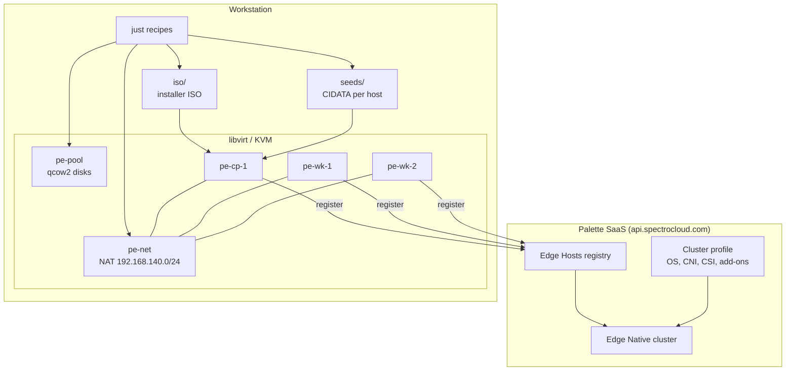
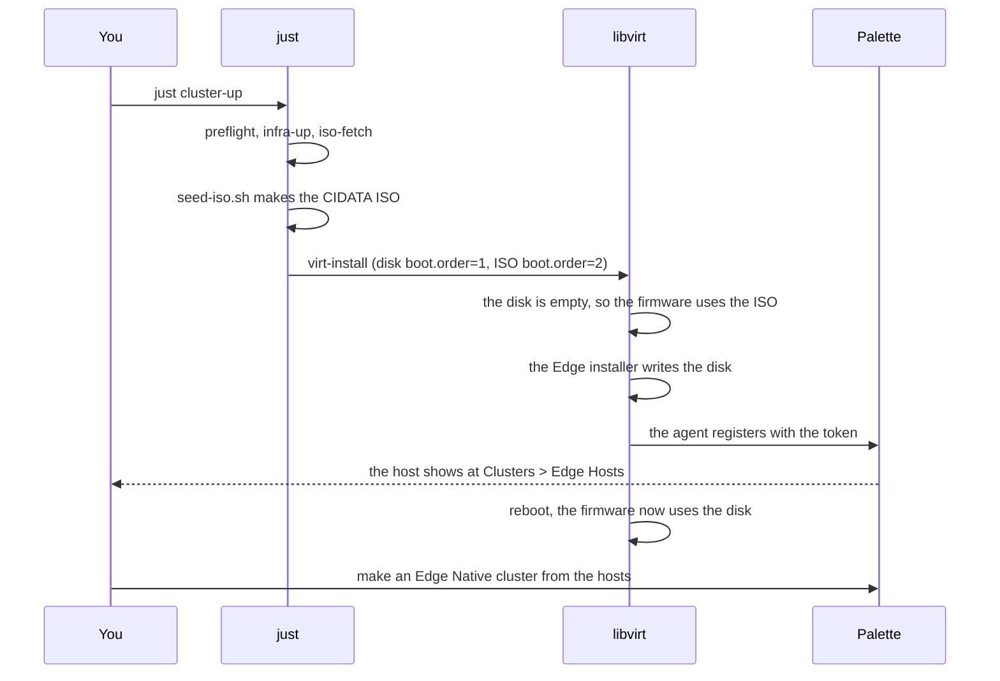

# Architecture

## The parts



The workstation owns the virtual machines. Palette owns the cluster profile and
the cluster. The seed ISO is the only link between the two. It carries your
endpoint, your project, and your registration token.

## The lifecycle of one host



## Why the boot order matters

The system disk is `boot.order=1`. The installer ISO is `boot.order=2`. At the
first boot the disk is empty, so the firmware finds no boot loader and uses the
ISO. After the installation the disk has a boot loader, so the firmware uses the
disk. The result is one installation and no installation loop.

The alternative is an eject of the ISO at the correct moment. That is a manual
step, and a manual step breaks
[project rule 1](./rules.md#1-every-action-is-a-recipe).

This is the command that sets the order:

```bash
{{#include ../../scripts/host-up.sh:virtinstall}}
```

## Where the state lives

| State | Location | Removed by |
| --- | --- | --- |
| Virtual machines | libvirt, `qemu:///system` | `just cluster-down` |
| Disk images | `/var/lib/libvirt/images/$LAB_NAME` | `just cluster-down` |
| Network and pool | libvirt | `just infra-down` |
| Seed ISO files | `seeds/` (git ignores) | `just seed-clean` |
| Installer ISO | `iso/` (git ignores) | `just iso-clean` |
| Your token | `.env` (git ignores) | you delete the file |
| Edge Hosts, profiles, clusters | Palette SaaS | you, in Palette |

`just nuke` removes every local item except the installer ISO. Palette keeps the
Edge Host entries. Remove those entries in Palette.
