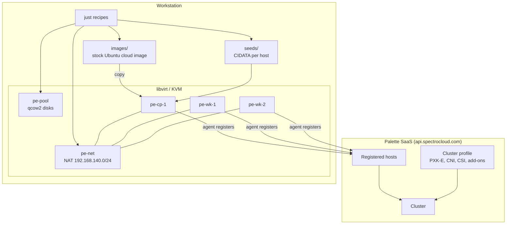
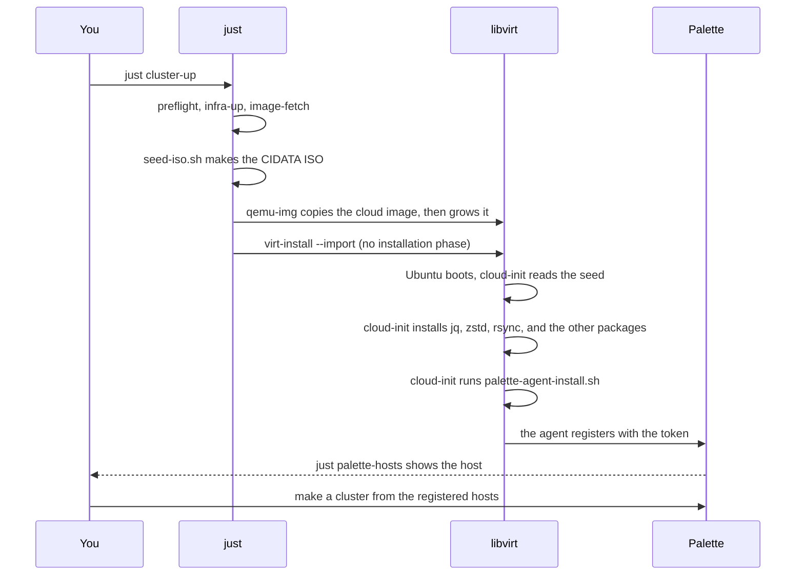

# Architecture

The lab uses Palette **agent mode**. Each host boots a stock Ubuntu cloud image.
cloud-init then installs the Palette agent, and the agent registers the host.

The lab builds no operating system image. It needs no Docker and no CanvOS. See
[Why agent mode](#why-agent-mode).

## The parts

The workstation owns the virtual machines. Palette owns the cluster profile and
the cluster. The seed ISO is the only link between the two. It carries your
endpoint, your project, and your registration token.

## The lifecycle of one host

## Why agent mode

Palette gives two ways to make an edge host.

| | Edge Native | Agent mode |
| --- | --- | --- |
| Operating system | A custom image that you build | The stock Ubuntu cloud image |
| Build tool | CanvOS with Earthly | None |
| Docker on the workstation | Necessary | Not necessary |
| Build time for each change | 15 to 20 minutes | None |
| First boot | Installs the operating system | Starts the operating system |
| Kubernetes | PXK-E, k3s, RKE2, and more | PXK-E and k3s |

Edge Native has no ready-made image. Spectro Cloud publishes no generic
installer ISO, so that path always starts with a CanvOS build, and CanvOS needs
Docker. The Spectro Cloud documentation for agent mode says the opposite for the
host: "Avoid installing Docker on the host where you want to install the agent."

Agent mode fits this lab better. The lab tests combinations of Kubernetes, CNI,
CSI, and add-ons. Those live in the cluster profile in Palette, not in the
operating system image. A new combination therefore needs no new image.

## Two details that matter

**There is no installation phase.** The cloud image already holds a working
Ubuntu. `virt-install --import` starts it. `qemu-img convert` copies the image
for each host, and `qemu-img resize` grows the copy. cloud-init grows the file
system at the first boot. A host is ready in seconds, not minutes.

**The agent installs at the first boot only.** cloud-init writes a marker file
at `/var/lib/palette-agent-installed`. A second boot reads the marker and makes
no change.

## Where the state lives

| State | Location | Removed by |
| --- | --- | --- |
| Virtual machines | libvirt, `qemu:///system` | `just cluster-down` |
| Disk images | `/var/lib/libvirt/images/$LAB_NAME` | `just cluster-down` |
| Network and pool | libvirt | `just infra-down` |
| Seed ISO files | `seeds/` (git ignores) | `just seed-clean` |
| Ubuntu cloud image | `images/` (git ignores) | `just image-clean` |
| Your token | `.env` (git ignores) | you delete the file |
| Hosts, profiles, clusters | Palette SaaS | you, in Palette |

`just nuke` removes every local item except the cloud image. Palette keeps the
host entries. Remove those in Palette.
