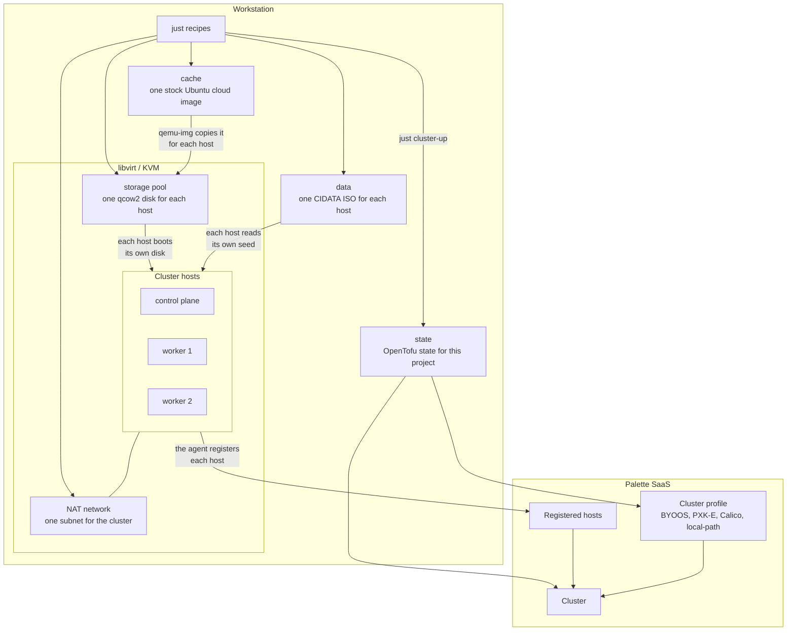
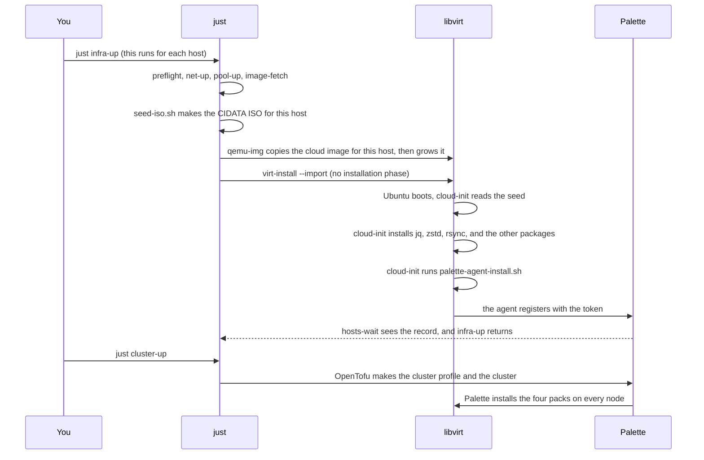

# Architecture

This page names each part of the tooling, and walks one virtual machine from a
cloud image to a node of the cluster.

## Purpose

The tooling validates a combination of an operating system, a CNI, a CSI, and
add-on packs. You test the combination on virtual machines first. You commit the
combination to real hardware only after the test passes.

The combination lives in the cluster profile in Palette, and not in an operating
system image, so a new combination needs no new image and no new build. That is
what makes a second test cheap.

The reference workstation is a System76 Thelio with 32 cores and 128 GB of RAM.
Any Linux workstation with KVM and sufficient memory works.
[The workstation](./workstation.md) gives the capacity that one cluster needs.

## The parts

| Part | Function |
| --- | --- |
| Palette SaaS | Holds the cluster profiles and the packs. Registers the hosts. |
| Ubuntu cloud image | The stock operating system. The tooling builds no image. |
| Seed ISO | Gives the agent your tenant endpoint, project, and token. |
| Palette agent | Installs at the first boot and registers the host. |
| libvirt / KVM | Runs the virtual machines. |
| OpenTofu | Makes the cluster profile and the cluster in Palette. |
| `just` | Runs every action in this repository. |
| mdBook | Builds this documentation. |

The tooling uses Palette **agent mode**. Each host runs a stock Ubuntu cloud
image, so the tooling builds no operating system image. See
[Design decisions](./decisions.md#agent-mode-not-edge-native).

## How the parts fit together

The tooling makes one virtual machine for each Kubernetes node. Each machine
boots a stock Ubuntu cloud image. cloud-init then installs the Palette agent, and
the agent registers the machine with your Palette tenant. Palette makes the
cluster from the machines that registered.

Every host gets its own copy of the cloud image and its own seed ISO. The cluster
downloads the image one time. `qemu-img` then copies it into the storage pool
for each host, which keeps the hosts independent.

The workstation owns the virtual machines. Palette owns the cluster profile and
the cluster. The seed ISO is the only link between the two. It carries your
endpoint, your project, and your registration token.

The OpenTofu state is the record of the cluster layer. It names the profile and
the cluster that `just cluster-up` made, so `just cluster-down` can remove
exactly those two objects and nothing else.

See
[The project layout](./project-layout.md#what-new-project-does).

## The lifecycle of one host

## The first boot

**There is no installation phase.** The cloud image already holds a working
Ubuntu. `virt-install --import` starts it. `qemu-img convert` copies the image
for each host, and `qemu-img resize` grows the copy. cloud-init grows the file
system at the first boot. A host is ready in seconds.

**The agent installs one time.** cloud-init writes a marker file at
`/var/lib/palette-agent-installed`. A second boot reads the marker and makes no
change.

**The host restarts one time.** The installer enables the agent services but
does not start them, because they run at boot stages. cloud-init therefore
restarts the host after a correct installation. The host registers a minute or
two later. A failed installation gives no restart, so the host stays up and you
can read `/var/log/palette-agent-install.log`.

**The seed ISO goes to the storage pool.** The seed directory is mode 0700
because it holds the token, and the qemu user cannot enter it. libvirt also
takes ownership of every file that a domain uses. `host-up` therefore copies the
seed into the pool and gives that copy to the domain, and the seed directory
keeps the original.

## Where the state lives

| Layer | State | Location | Removed by |
| --- | --- | --- | --- |
| Infrastructure | Virtual machines | libvirt, `$LIBVIRT_DEFAULT_URI` | `just infra-down` |
| Infrastructure | Disk images | `/var/lib/libvirt/images/$CLUSTER_NAME`, or `~/.local/share/palette-edge-libvirt/pools/$CLUSTER_NAME` in a session | `just infra-down` |
| Infrastructure | Network and pool | libvirt | `just infra-down` |
| Infrastructure | Registered hosts | Palette SaaS | `just infra-down` |
| Infrastructure | Seed ISO files | `~/.local/share/palette-edge-libvirt` | `just seed-clean` |
| Cluster | Profile and cluster | Palette SaaS | `just cluster-down` |
| Cluster | The OpenTofu state | `~/.local/state/palette-edge-libvirt` | `just remove-project` |
| Neither | Ubuntu cloud image | `~/.cache/palette-edge-libvirt` | `just image-clean` |
| Neither | Your token | `~/.config/palette-edge-libvirt/envs` | `just remove-project` |
| Neither | Your API key | `~/.config/palette-edge-libvirt/api-key` | `just api-key-clear` |
| Neither | OpenTofu | `~/.local/bin/tofu` | `just tofu-uninstall` |
| Neither | kubectl | `~/.local/bin/kubectl` | `just kubectl-uninstall` |

The disk images have two homes, because there are two libvirt connections. A
session daemon runs as you and cannot write under `/var/lib/libvirt`, so its
pool goes in the home directory. See
[Continuous integration](./ci.md#the-runner-uses-the-session-daemon).

A layer removes everything that it made, on both sides. The host record belongs
to the infrastructure layer, because registration makes it and it has no use
when the machine is gone.

`just nuke` removes both layers and the project: the machines, the host records,
the seeds, the registration token, the Palette project, and the environment
file. The cloud image and the API key stay, because neither belongs to one
project.
